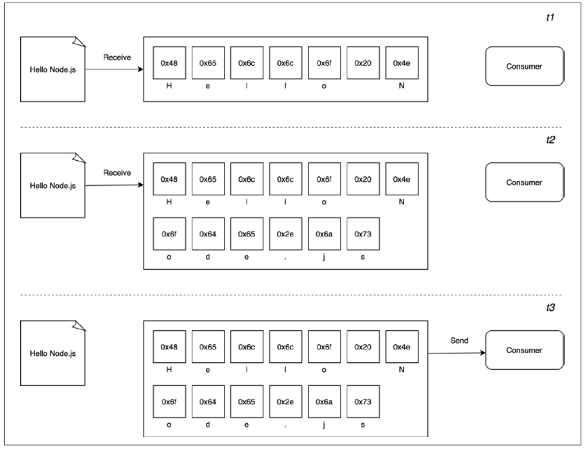

---
# try also 'default' to start simple
theme: default
# random image from a curated Unsplash collection by Anthony
# like them? see https://unsplash.com/collections/94734566/slidev
# apply any windi css classes to the current slide
class: 'text-center'
# https://sli.dev/custom/highlighters.html
highlighter: shiki
# show line numbers in code blocks
lineNumbers: true
# some information about the slides, markdown enabled
info: |
  ## Slidev Starter Template
  Presentation slides for developers.

  Learn more at [Sli.dev](https://sli.dev)
# persist drawings in exports and build
drawings:
  persist: false
---

# Using buffers and streams

---

# Good morning! 👋🏻

Same deal as yesterday:

- Pull down the repo with today's slides and exercises.
- Have a think about a takeaway from last Monday.

---

By the end of this section, you'll:
- Understand the anatomy of a Buffer instance.
- Safely and unsafely create buffers.
- Convert between buffers and other data structures.

---
layout: two-cols
---

# What is a buffer?

All of the APIs we've used so far have been in buffer mode. For an input operation, buffer mode causes all the data coming from a resource to be collected into a buffer until the operation is completed. It is then passed back to the caller as one single blob of data.

::right::

<!--  -->

---

# The Buffer Instance

<v-clicks>

- When it was first introduced to Node, JS didn't have a native binary type
- We now have ArrayBuffer and a number of Typed Arrays to provide different "views" of a buffer
- Full list of these on [MDN](https://developer.mozilla.org/en-US/docs/Web/JavaScript/Typed_arrays)
- When these new structures were added to JS, the Buffer constructor internals were refactored
- So, a buffer object is both an instance of Buffer and an instance of Uint8Array
- That means we can use the full API of [Uint8Array](https://developer.mozilla.org/en-US/docs/Web/JavaScript/Reference/Global_Objects/Uint8Array) as well as the [Buffer methods](https://nodejs.org/dist/latest-v12.x/docs/api/buffer.html)

</v-clicks>

---

# Allocating Buffers

<v-clicks>

> You'll rarely need to allocate a buffer but if you do, don't use the new keyword with Buffer constructor.

The correct way to allocate a buffer of a certain amount of bytes is:

```js
const buffer = Buffer.alloc(10)
```

This is the safe way to allocate buffers - the unsafe way is:

```js
const buffer = Buffer.allocUnsafe(10)
```

</v-clicks>

---

# Converting String to Buffers

<v-clicks>

You can create buffer from a string:

```js
const buffer = Buffer.from("This is a string.")
```

In order to convert a string, an encoding is assumed. The default encoding is UTF8. Be careful with string lengths!

You can set the encoding with a second parameter:

```js
const buffer = Buffer.from("This is a string", "utf16le")
```

The supported byte-to-text encodings are hex and base64. Supplying one of these encodings allows us to represent the data in a string, this can be useful for sending data across the wire in a safe format.


</v-clicks>

---

# Converting Buffers to Strings

<v-clicks>

To convert a buffer to a string, call the toString method on a Buffer instance.

Be careful to decode with the same method as it was encoded (duh!).

The UTF8 encoding format has between 1 and 4 bytes to represent each character, if for any reason one or more bytes is truncated from a character this will result in encoding errors.

So in situations where we have multiple buffers that might split characters across a byte boundary the Node core string_decoder module should be used.

</v-clicks>

---

# JSON Serializing and Deserializing Buffers

<v-clicks>

When JSON.stringify encounters any object it will attempt to call a toJSON method on that object if it exists. 

The Buffer `toJSON` method returns a JS object to represent the Buffer in a JSON-friendly way.


</v-clicks>

---

# What about streams?

<v-clicks>

- Motto in the community to "stream all the things"
- Described as "Node's best and most misunderstood idea"
- This is related to technical properties (performance and efficiency) and the elegance and the way they fit into the Node.js philosophy
- Streams allow us to process the data as soon as it arrives from the resource. As soon as data is received from the resource, it is immediately passed to the consumer. The consumer can choose to process the data now or wait until it is all finished.

</v-clicks>

---
layout: two-cols
---

# Spacial efficiency

<v-clicks>

Streams allow us to do things that would not be possible by buffering data and processing it all at once. For example, reading a large file, dealing with a huge response. You can't allocate more than a few GBs of data for a buffer without running out of space.

```js
import buffer from 'buffer' 
console.log(buffer.constants.MAX_LENGTH)
```

Let's consider a command line tool that uses GZIP for a file. 

</v-clicks>

::right::

<v-clicks>

```js
import { promises as fs } from 'fs' 
import { gzip } from 'zlib' 
import { promisify } from 'util' 

const gzipPromise = promisify(gzip) 

const filename = process.argv[2] 

async function main () {
 const data = await fs.readFile(filename)
 const gzippedData = await gzipPromise(data)
 await fs.writeFile(`${filename}.gz`, gzippedData)
 console.log('File successfully compressed') 

} 

main()
```

If we choose a file that is big enough, we'll get an error message like this:

```
RangeError [ERR_FS_FILE_TOO_LARGE]: File size is greater than possible Buffer
```

</v-clicks>

---

# Spacial Efficiency - Refactor to Streams

```js
import { createReadStream, createWriteStream } from 'fs' 
import { createGzip } from 'zlib' 

const filename = process.argv[2] 

createReadStream(filename)
  .pipe(createGzip())
  .pipe(createWriteStream(`${filename}.gz`))
  .on('finish', () => console.log('File successfully compressed'))
```

Streams are amazing because of their interface and composability - it gives us clean, elegant and concise code.

NB - we've left out error handling for brevity but not that streams are EventEmitters and we should have an `.on("error", ()=>{})` handler.

---

# Time efficiency

Let's imagine an app that compresses a file, uploads it to a remote HTTP server which then, in turn, decompresses it there and saves it to the file system.

Using a buffered API, the upload would only start when the entire file had been read and compressed. A better solution would be to use streams. The client can stream chunks of compressed data as soon as they are read and the server can decompress every chunk as soon they are received from the client.

---
layout: two-cols
---

# Server.js

```js
import { createServer } from "http";
import { createWriteStream } from "fs";
import { createGunzip } from "zlib";
import { basename, join } from "path";

const server = createServer((req, res) => {
  const filename = basename(req.headers["x-filename"]);
  const destFilename = join("received_files", filename);
  console.log(`File request received: ${filename}`);
  req
    .pipe(createGunzip())
    .pipe(createWriteStream(destFilename))
    .on("finish", () => {
      res.writeHead(201, { "Content-Type": "text/plain" });
      res.end("OK\n");
      console.log(`File saved: ${destFilename}`);
    });
});

server.listen(3000, () => console.log("Listening on http://localhost:3000"));
```

::right::

In the example, req is a stream object that is used by the server to receive the request data in chunks from the network. Thanks to Node.js streams, every chunk of data is decompressed and saved to disk as soon as it is received.

<!--

 You might have noticed that, in our server application, we are using basename() to remove any possible path from the name of the received file. This is a security best practice as we want to make sure that the received file is saved exactly within our received_ files folder. Without basename(), a malicious user could craft  a request that could effectively override system files and inject malicious code into the server machine. Imagine, for instance, what happens if filename is set to /usr/bin/node? In such a case, the attacker could effectively replace our Node.js interpreter with any arbitrary file.

-->

---
layout: two-cols
---

# Client.js

```js
import { request } from 'http' 
import { createGzip } from 'zlib' 
import { createReadStream } from 'fs' 
import { basename } from 'path' 

const filename = process.argv[2] 
const serverHost = process.argv[3] 

const httpRequestOptions = {
 hostname: serverHost,
 port: 3000,
 path: '/', 
 method: 'PUT',
 headers: { 
  'Content-Type': 'application/octet-stream',
  'Content-Encoding': 'gzip',
  'X-Filename': basename(filename) 
 } 
}

const req = request(httpRequestOptions, (res) => {
 console.log(`Server response: ${res.statusCode}`) 
})

createReadStream(filename)
  .pipe(createGzip())
  .pipe(req)
  .on('finish', () => { 

 console.log('File successfully sent')
})
```

::right::

When we run this, we pass the filename and the host as the second and third arguments. That's what process.argv is doing.

```sh
node gzip-send.js <path to file> localhost
```

---

# Composability

We've seen already that we can use the `.pipe()` to compose units - with each unit being responsibilty for a single functionality. This is possible because streams have a uniform interface and can understand each other in terms of API. The only prerequisite is that the next stream in the pipeline has to support the data type produced by the previous stream. 

We could then easily add encryption to our application before.

<!--

```js
import { createCipheriv, randomBytes } from 'crypto' // {1}
const filename = process.argv[2]  
const serverHost = process.argv[3]  
const secret = Buffer.from(process.argv[4], 'hex') // {2}
const iv = randomBytes(16) // {3}
```

Let's review what we changed here:
1. First of all, we import the createCipheriv() Transform stream and the randomBytes() function from the crypto module.
2. We get the server's encryption secret from the command line. We expect the string to be passed as a hexadecimal string, so we read this value and load it in memory using a buffer set to hex mode.
3. Finally, we generate a random sequence of bytes that we will be using as an initialization vector for the file encryption.

We then update the HTTP request:

```js
 

const httpRequestOptions = {
 hostname: serverHost,
 headers: { 
  'Content-Type': 'application/octet-stream', 
  'Content-Encoding': 'gzip',  
  'X-Filename': basename(filename),
  'X-Initialization-Vector': iv.toString('hex') // {1}
 }
}

// ...

const req = request(httpRequestOptions, (res) => {
 console.log(`Server response: ${res.statusCode}`) 

})

createReadStream(filename) 
 .pipe(createGzip()) 
 .pipe(createCipheriv('aes192', secret, iv)) // {2}
 .pipe(req)

// ..
```

The main changes here are:
1. We pass the initialization vector to the server as an HTTP header.
2. We encrypt the data, just after the Gzip phase.

And on the server

```js
 

import { createDecipheriv, randomBytes } from 'crypto' 

const secret = randomBytes(24) 
console.log(`Generated secret: ${secret.toString('hex')}`)

 
const server = createServer((req, res) => {  
const filename = basename(req.headers['x-filename']) 
const iv = Buffer.from(req.headers['x-initialization-vector'], 'hex') // {1}
const destFilename = join('received_files', filename) 
console.log(`File request received: ${filename}`)  

req
 .pipe(createDecipheriv('aes192', secret, iv)) // {2}
 .pipe(createGunzip()) 
 .pipe(createWriteStream(destFilename))  
// ...
```

Here, we are applying two changes:
1. We have to read the encryption initialization vector (nodejsdp.link/iv) sent by the client.
2. The first step of our streaming pipeline is now responsible for decrypting the incoming data using the createDecipheriv Transform stream from the crypto module.

-->

---

# The Anatomy of Streams

Every stream in Node.js is an implementation of one of the four base abstract classes:
- Readable
- Writable
- Duplex
- Transform

Streams have two operating modes, Binary and Object.

---

# Reading from a stream

There are two ways to receive data from a Readable stream - flowing or non-flowing (paused).

Non-flowing is the default.

---

# Readable - Non-flowing Mode
